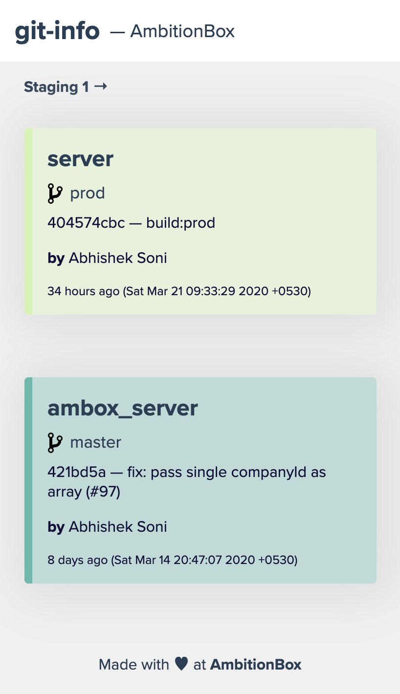

# git-info

Get all your project's git info, across multiple environments, all in one place.



# Installation

1. Clone/download this repo to wherever you want to host your git-info app

2. Create a `.env` file and specify which `PORT` you want your app to run on. (default: 3000)

3. For security reasons, we allow a `BASE_PATH` to be set and only allow projects under that `BASE_PATH` to be queried/displayed in the app. (default: _empty string_)

4. Inside static, create a `config.json` file. This file will contain your environment, projects, domain, etc. related info. There is a `example.config.json` for your convenience.

Let's roll. :tada:

# Start

```
cd server
```

```bash
npm run build
```

```bash
npm run start
```
